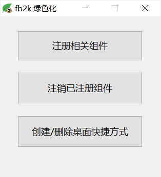

# foobar2000 绿色化工具

**【介绍】**   
foobar2000 绿色化工具，适用于绿色或便携包的 foobar2000，可注册和反注册相关组件，主要是 ShellExt32.dll， ShellExt64.dll 以及 dsd_trancoder 组件（32位和64位）。另外可方便地创建和删除 foobar2000 桌面快捷方式。  
由于工具没认证啥的，又涉及系统敏感操作，很多杀毒软件会报毒，开源的东东，私货是没有的，介意的朋友不要下载，或下载 bat 版本，功能是一样的，只是使用交互没那么好。
\
\
**【界面】**  

\
\
**【安装】**  
放置到 foobar2000 根目录下运行。注册和反注册操作会自动检测组件是否存在。
\
\
**【本工具收录于 foobar2000-tools 仓库，如需要英文版也可以在里面找到】**  
https://github.com/dream7180/foobar2000-tools\
https://gitee.com/dream7180/foobar2000-tools
