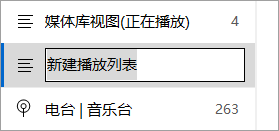
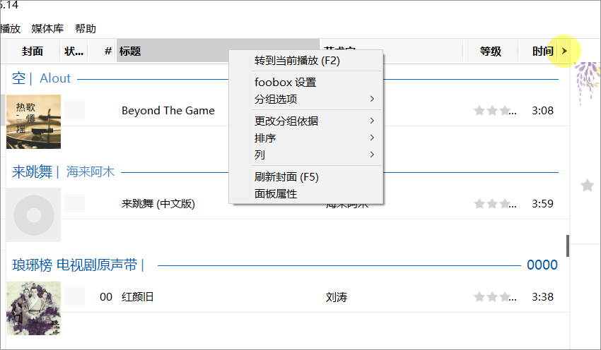
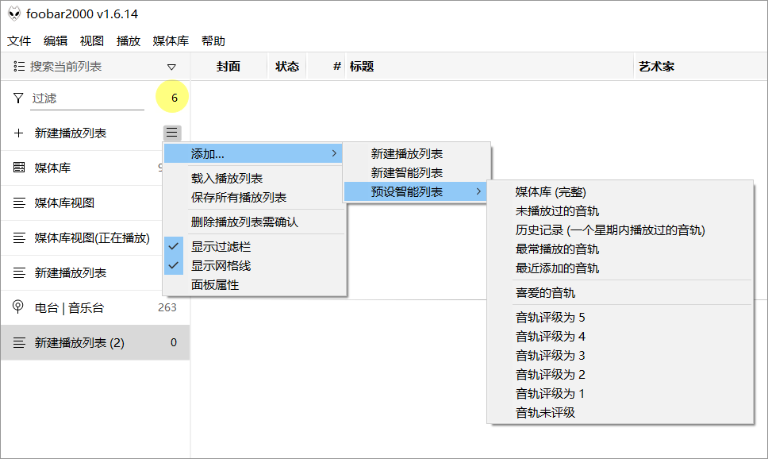
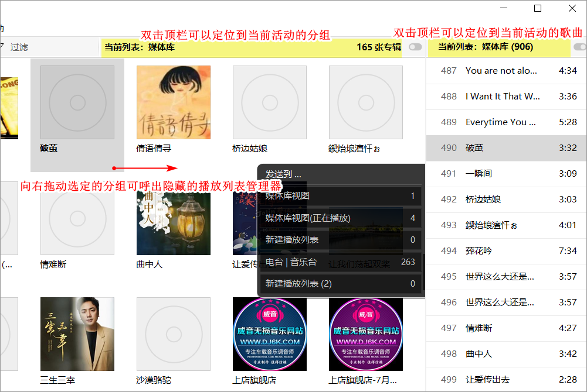
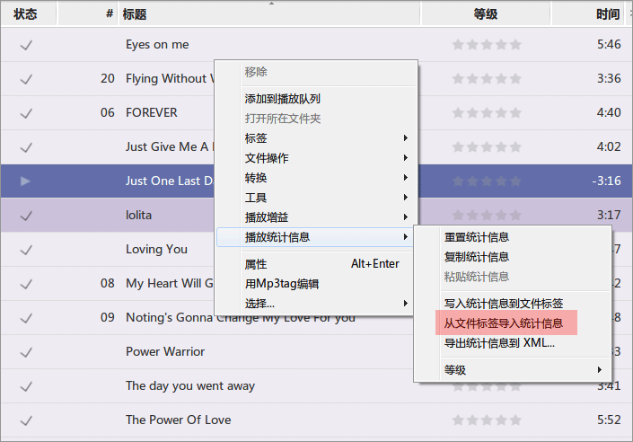

# foobar2000 和 foobox 帮助与技巧

### 文字输入框  
foobox 界面中的文字输入框，如播放列表重命名等，需要回车才能生效，重要的事情说三遍：回车，回车！

\
 
### 屏幕搜索   
foobox 的主要面板支持直接键盘输入即时搜索和定位歌曲，6.0 版完善了这一功能。  
各个面板的搜索关键词有些出入：  
-- 播放列表视图：支持歌曲名字 (title)，艺术家 (artist) 和专辑 (album) 进行搜索;  
-- 封面浏览器：支持搜索当前模式下的组别名称，如在专辑模式下则以专辑名称为关键词。
\
\

\
 
### 播放列表视图  
在播放列表视图顶栏任意处右键点击，或者左键点击最右边的 > 样图标，即可以呼出右键菜单，进入各种选项及 foobox 设置。 
\
 

\
 
### 播放列表管理器
-- 双击过滤栏（如果设置为显示）的列表数量可快速定位到当前的活动列表。   
-- 播放列表管理器的菜单里可以快速添加一些预设的智能列表。
\
 

\
 
### 右栏封面和歌曲信息

  
\
 
### 封面浏览器
  
  
\
 
### 评级数据  
歌曲标签里有评级信息，Windows文件管理器里都有显示，但是 foobox 显示不出来，怎么办？  
在媒体库列表里全选歌曲，然后右键，点击图中的 "<u>从文件标签导入统计信息</u>"，歌曲的评级信息就能导入回来了！  
  
foobox 的音频评级默认使用 playcount 组件（数据文件记录），并没有写入音频文件的标签，如果需要写入文件，请在 "foobox 设置" 里更改设定。
  
\
 
\
\

本文会持续更新...  


