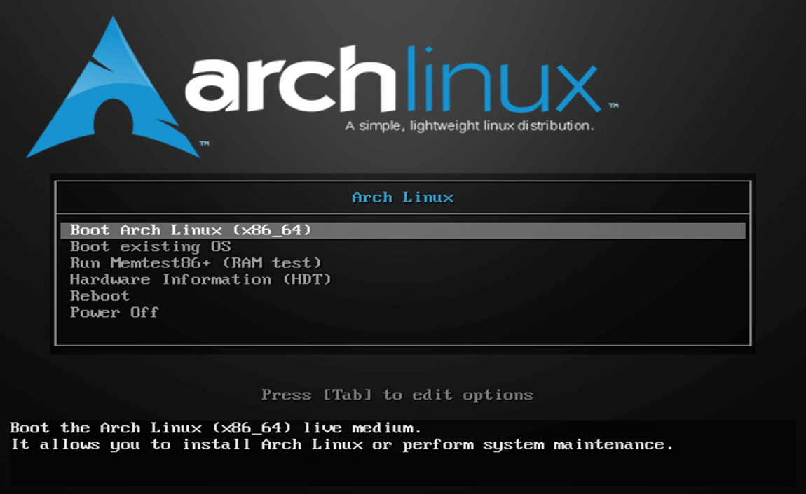

# Archlinux 的安装指引：nvme + uefi


Archlinux 由于没有图像安装方式，让很多人望而止步。其实她的安装步骤和其他发行版并没有什么区别，只是没有封装的图形交互界面，冷冷的命令行仿佛在劝告没有基础的人别去碰她。我的建议是越早使用 archlinux 越好，不怕开始的困难，迈过以后或许你会发现这根本就不算困难，她的 KISS 理念，滚动升级以及优秀的包管理，让你更好地掌控你的系统，有点一劳永逸的味道，绝对值得你去尝试和学习。 
本文将大致介绍 archlinux 的安装过程，我安装的时间时是2022年，还是比较新的，何况有问题找 Wiki，[Archlinux Wiki](https://wiki.archlinux.org/) 的不是一般的强大，而是无敌的存在。  

## 1 USB 启动安装  
从官网下载最新的 ISO 镜像，写入U盘作为安装启动介质。  
在 linux 下用 DD，cat，cp，tee，pv 等命令都可以，如常用的 dd：
```bash
$ dd bs=4M if=path/to/archlinux-version-x86_64.iso of=/dev/sdx conv=fsync oflag=direct status=progress
```
在 Windows 下可以用 win32diskimager，USBwriter，USBImager，Rufus 等工具，非常简单。  
制作完成后重启从 USB 启动进入安装，当然，出现的是命令行。

## 2 查看启动模式，确定是否 UEFI 方式

```bash
$ ls /sys/firmware/efi/efivars
```

## 3 查看磁盘情况，进行分区操作
创建 linux 分区，如不存在，先不需要格式化。
```bash
$ cfdisk /dev/nvme0n1
$ cfdisk /dev/sdc
```
本例中的硬盘分区使用情况如下：
```perl
/dev/nvme0n1p1  # 预先分好的 ESP 分区
/dev/nvme0n1p2  # Archlinux 根分区 /
/dev/sdc3  # 将会挂载为 /home
```

布局硬盘


```bash
# NVME+systemd-boot方式 （systemd-boot需要把ESP永久mount到/boot上）
$ mkfs.ext4 /dev/nvme0n1p2
$ mount /dev/nvme0n1p2 /mnt
mkdir /mnt/boot
mount /dev/nvme0n1p1 /mnt/boot
$ mkdir /mnt/home
$ mount /dev/sdc3 /mnt/home
```

如需开swap（内存足够不推荐 swap）:

```bash
$ mkswap /dev/sdxx
$ swapon /dev/sdxx
```

## 4 更新系统时间

```bash
$ timedatectl set-ntp true
```

## 5 使用北外的源

```inf
# /etc/pacman.d/mirrorlist
Server = https://mirrors.bfsu.edu.cn/archlinux/$repo/os/$arch
```

## 6 安装必须的软件包

```bash
$ pacman -Syy
$ pacstrap -i /mnt base linux linux-firmware base-devel
```

## 7 生成 fstab 文件

```bash
$ genfstab -U -p /mnt >> /mnt/etc/fstab
```

## 8 进入新系统进行配置

```bash
$ arch-chroot /mnt
```

## 9 设置时区

```bash
$ timedatectl set-timezone Asia/Shanghai
```

写入hwclock

```bash
$ hwclock -w --localtime
```

## 10 编辑 locale.gen, 去注释

```inf
# /etc/locale.gen

en_US.UTF-8 UTF-8
zh_CN.UTF-8 UTF-8
```

运行
```bash
$ locale-gen
```
把 locale 配置写入 locale.conf
```bash
$ echo LANG=en_US.UTF-8 > /etc/locale.conf
$ echo LC_CTYPE=zh_CN.UTF-8 >> /etc/locale.conf
```

## 11 网络

```bash
$ echo myhostname > /etc/hostname
```

编辑 hosts

```inf
# /etc/hosts

127.0.0.1 localhost localhost.localdomain localhost4 localhost4.localdomain4
127.0.1.1 myhostname.localdomain myhostname
::1 localhost localhost.localdomain localhost6 localhost6.localdomain6
# 如果绑定了 IP，如 192.168.1.6，可以添加
192.168.1.6 myhostname
```

如果系统有一个永久的 IP 地址，请使用这个永久的 IP 地址而不是 127.0.1.1  

**启用网络 (方式一：使用原生的 systemd-networkd)**  
查看网卡名称：
```bash
$ ip -c a

# 在输出中找到 eno1 （本例）中的 altname enp0s31f6，即为配置中使用的网卡名称
```
编辑网络配置文件，更多请参考 [Archlinux Wiki](https://wiki.archlinuxcn.org/wiki/Systemd-networkd?rdfrom=https%3A%2F%2Fwiki.archlinux.org%2Findex.php%3Ftitle%3DSystemd-networkd_%28%25E7%25AE%2580%25E4%25BD%2593%25E4%25B8%25AD%25E6%2596%2587%29%26redirect%3Dno)
```inf
# /etc/systemd/network/20-wired.network

[Match]
Name=enp0s31f6

[Network]
DHCP=yes
```
```bash
$ systemctl enable systemd-networkd.service
```
**启用网络 (方式二：使用 networkmanager)**

```bash
$ Pacman -S networkmanager
$ systemctl enable NetworkManager
```

## 12 设置root密码

```bash
$ passwd
```

可以一并添加用户

```bash
$ useradd -G root,users -m username
$ passwd username
```

## 13 systemd-boot启动器  
我们前面已经挂载了ESP分区到/boot

```bash
$ bootctl --path=/boot install
$ cat /usr/share/systemd/bootctl/arch.conf > /boot/loader/entries/arch.conf
$ blkid /dev/nvme0n1p2 >> /boot/loader/entries/arch.conf
```
推荐使用 PARTUUID 来识别分区，修改 loader entry
```inf
# /boot/loader/entries/arch.conf

options root=PARTUUID=xxxxx rw

# 要查看 PARTUUID，使用 blkid 命令
```

修改loader.conf

```inf
# /boot/loader/loader.conf

default  arch.conf
timeout  4
console-mode max
editor   no
```

## 14 安装完成! 退出并重启电脑

```bash
$ exit
$ umount -R /mnt
$ reboot
```
## 15 启动故障修复
如果有启动有问题需要修复，可以 USB 启动后把已安装的系统先挂载再 arch-chroot，就可以进入已安装的系统进行修复工作了，如重新安装引导器等：
```bash
$ mount /dev/nvme0n1p2 /mnt
$ arch-chroot /mnt
```

