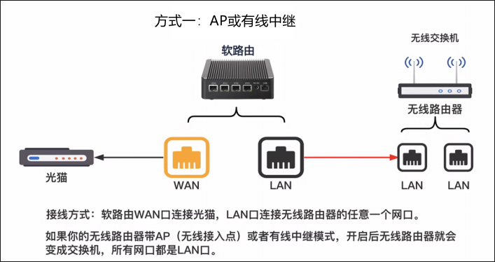
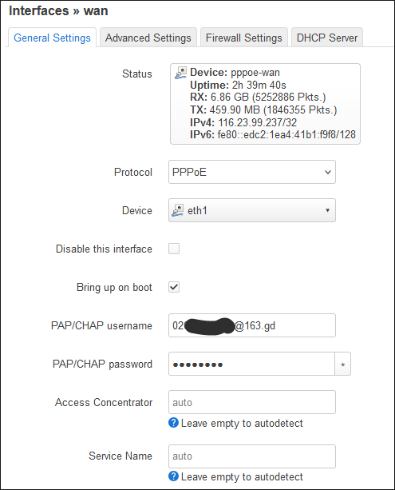

# OpenWrt 主路由配置笔记

作为现今最流行的软路由开源系统，OpenWrt 深得各位玩家的喜爱，最近淘了个 J4125 四 2.5G 网口小主机，动手安装 OpenWrt 来做主路由。  
## 1 组网方式
作为主路由，其连接方法有以下两种，强烈推荐第一种，解放 WIFI 路由器只作有线中继，而且减少一次 NAT 转换。  
 

 

## 2 版本选择
+ OpenWrt 官方版，安装包最小，默认可用空间约 100m。
+ 第三方修改版 ImmortalWrt，有不少自己的优化，可以开 Fullcone NAT，默认可用空间约 300m，更新落后于官方版。 
+ 在线自编译版，如 Kwrt，悟空的 ImmortalWrt 编译版等，特点是可定制添加软件，或自定义可用空间等，Kwrt 还提供丰富的软件包。  
  
用了一段时间 ImmortalWrt 和其他第三方编译版后，我最终回到 OpenWrt 的官方版本，理由：
+ 官方版本更新快，固件很丐很纯净。  
+ 很多版本在我这 NAT 环回上有点问题，而 OpenWrt 24.10 没有这个问题。
+ 预装软件什么的对我没什么意义，可用空间扩展也不是难题。
+ 自编译版几乎没法获得任何官方更新，尤其是一些对应内核的包。   
  
## 3 安装
到[官网固件下载页面](https://firmware-selector.openwrt.org/)，关于固件的选择，EXT4 和 Squashfs 格式都可以，由于我是标准小电脑，不怕变砖，所以选择最熟悉的 EXT4 固件
+ openwrt-24.10.0-rc6-x86-64-generic-ext4-combined-efi.img.gz 

我们选择从[微PE](https://www.wepe.com.cn/) U盘启动来写固件到硬盘，写盘工具有命令行的 [physdiskwrite](https://m0n0.ch/wall/physdiskwrite.php)，GUI 工具 [Roadkil's DiskImage](https://www.roadkil.net)等。  
physdiskwrite 写入: `physdiskwrite.exe -u openwrt-22.03.2-x86-64-generic-ext4-combined-efi.img`  
按提示写入即可，至于 DiskImage 则没什么可说的了。

## 4 基本配置和上网
+ 安装完成重启后浏览器进入 192.168.1.1，初始用户名是 root，密码是空的，进入后我们可以先设定管理员密码。
+ 接着我们得先让软路由上网，我这是由路由来拨号，一般不是桥接的话默认 wan 口 DHCP 就可以上网了。  
`Network -> Interfaces -> wan` 口点 `Edit` 设置 `PPPOE` 拨号：
  
+ lan 口设置  
`Network -> Devices -> br-lan` 口点 `Configure...` 把路由器三个 lan 口都桥接起来方便统一管理  
 
+ 查看 lan 口的 DHCP `Network -> Interfaces -> lan -> DHCP Server` 口点 `Edit`，按需设置或保持默认
 
+ OpenWrt 默认就开启了 IPV6，下发到下游设备也没问题，比某些不开 IPV6 的第三方编译的版本省心不少  

## 5 国内源，中文包及为扩容准备
+ 先把官方源换到国内的清华大学，为了一键更换，用 SSH 连接软路由，执行：  
`sed -i 's_https\?://downloads.openwrt.org_https://mirrors.tuna.tsinghua.edu.cn/openwrt_' /etc/opkg/distfeeds.conf`
+ 安装中文语言 `luci-i18n-base-zh-cn`
+ 安装我们接下来扩容要用的 `cfdisk`, `block-mount` (需重启生效)

## 6 根分区`/`扩容
思路就是把硬盘空余空间创建新分区并把它挂载成 `/`，并把原根分区文件复制过去。  
+ SSH 连接软路由，运行 `cfdisk` 在空余空间创建一个新分区为 linux 格式，本例分区为 `/dev/sda3`  
+ 退出 cfdisk 后格式化分区:  
`mkfs.ext4 /dev/sda3`
+ 在 '系统 -> 挂载点' 里启用新的挂载点 `/dev/sda3` 挂载为 `根文件系统 (/)`  
+ 高级设置里选择文件系统 `ext4`，挂载选项填入 `rw,noatime`  
+ 保存应用后，在 ssh 里按挂载点得提示依次运行，注意分区要按实际情况：
```bash
mkdir -p /tmp/introot
mkdir -p /tmp/extroot
mount --bind / /tmp/introot
mount /dev/sda3 /tmp/extroot
tar -C /tmp/introot -cvf - . | tar -C /tmp/extroot -xf -
umount /tmp/introot
umount /tmp/extroot
```

## 7 设置时区和 NTP
+ 到`系统 -> 常规设置`里把社区改成 `Asia/Shanghai`
+ 在`系统 -> 时间同步`里把默认的NTP服务器删掉添加一些速度快的比如：
```json
ntp1.aliyun.com
ntp.tencent.com
time.apple.com
```

## 8 安装软件
+ 安装模拟终端 `luci-i18n-ttyd-zh-cn`
+ 按需安装 `luci-compat`，某些第三方 luci 程序界面不兼容需要依赖它，如 ddns-go
+ 可以下载 [kwrt](https://dl.openwrt.ai/releases/24.10/packages/x86_64/kiddin9/) 所编译的一些好用的软件：  
添加关机 `luci-app-poweroffdevice`  
概览添加 CPU 监控 `luci-app-cpu-status`  
概览添加温度监控 `luci-app-temp-status`  

